# User Manual

Public-site workflows for visitors, invited owners, and returning members.

## Table of Contents

- [US-01 — Learn about APIC](#us-01-learn-about-apic)
- [US-02 — Sign in (no public signup)](#us-02-sign-in-no-public-signup)
- [US-03 — Accept an invitation](#us-03-accept-an-invitation)
- [US-04 — Reset a forgotten password](#us-04-reset-a-forgotten-password)

---

## US-01 — Learn about APIC

### Overview

As a visitor (not signed in), browse the public marketing site to learn what APIC is, explore category pages, and find how to get in touch or sign in. There is no public self-registration.

**Note:** Category pages such as **Food & Dining** and **Services & Maintenance** are public. **About Us** and **Events & Activities** currently require sign-in; choosing them while signed out opens the **Sign in** page.

### Steps

#### Step 1 — Open the home page and go to Food & Dining

- Open the site home page.
- In the brown navigation bar, click **Food & Dining**.
- You should see the **Food & Dining** category page with the hero title and the **Members places map** section below.

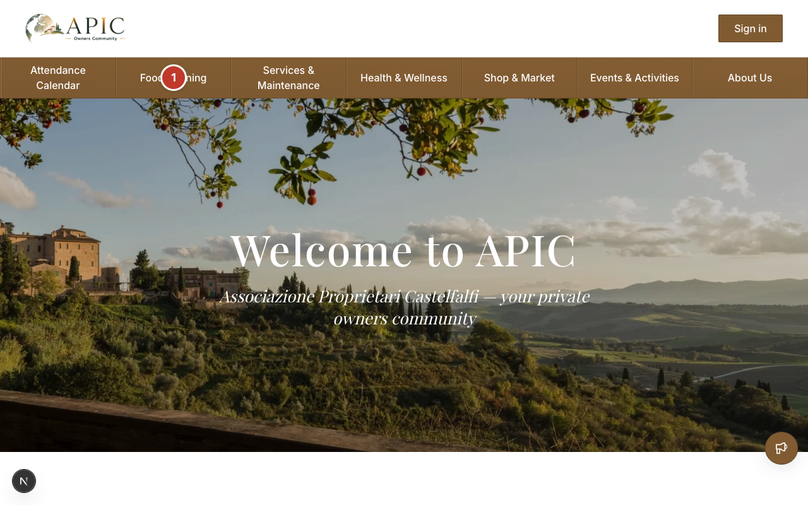

#### Step 2 — Browse another category

- On the **Food & Dining** page, click **Services & Maintenance** in the navigation bar.
- You should see the **Services & Maintenance** page (hero title **Services & Maintenance**, subtitle **Trusted Professionals & Repairs**).

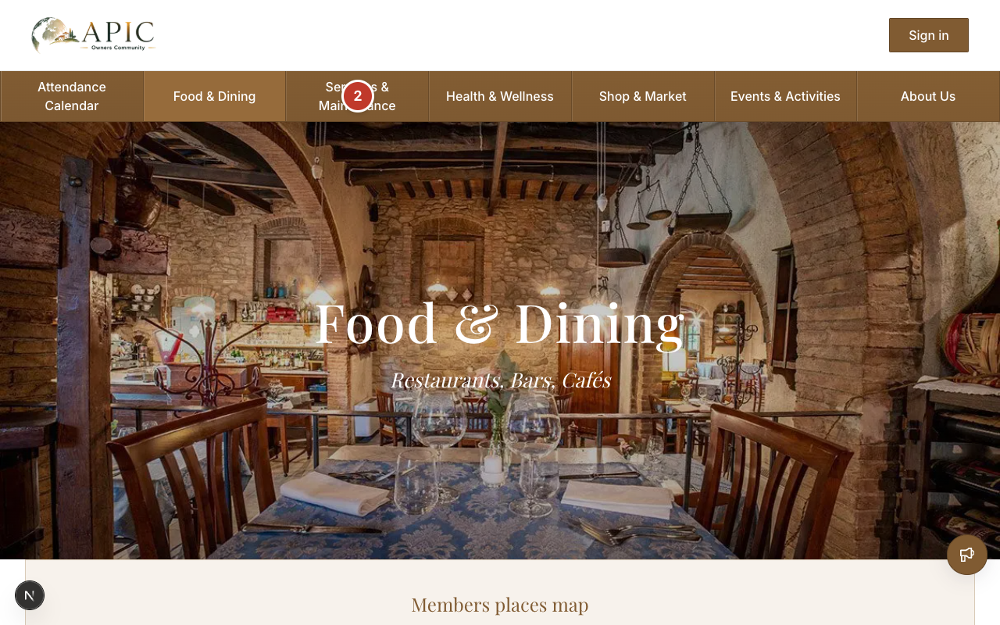

#### Step 3 — Reach sign-in from a category page

- On a category page, scroll to **Members places map**.
- Click **Sign in to browse**.
- You should be taken to the **Sign in** page (local listings and map pins are available after sign-in).

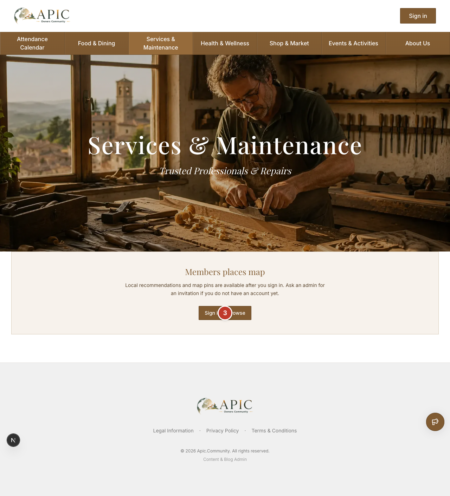

#### Step 4 — Try About Us while signed out

- Return to the home page.
- Click **About Us** in the navigation bar.
- You should be redirected to **Sign in** (with a return path to About). Use **Events & Activities** the same way — it also requires an account when you are signed out.

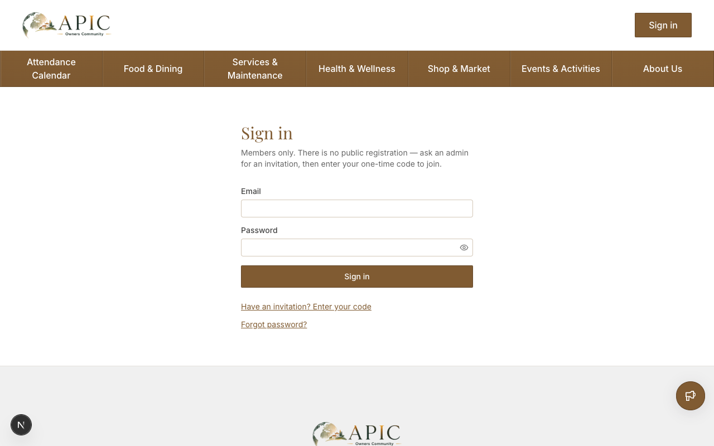

---

## US-02 — Sign in (no public signup)

### Overview

Members and admins sign in with email and password to open the private members area. There is no public registration link on this page — new owners join only by invitation (see [US-03](#us-03--accept-an-invitation)).

### Steps

#### Step 1 — Open Sign in and submit your credentials

- Click **Sign in** in the header, or open `/sign-in`.
- Enter your **Email** and **Password**.
- Click **Sign in**.
- You should see the members hub (**Members Area** / `/place`).

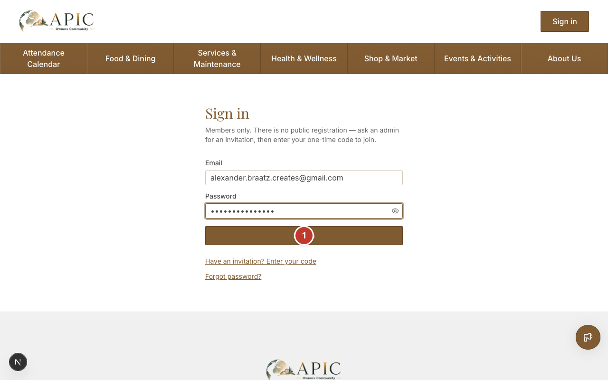

Related links on the sign-in page:

- **Have an invitation? Enter your code** → invitation flow ([US-03](#us-03--accept-an-invitation))
- **Forgot password?** → password reset ([US-04](#us-04--reset-a-forgotten-password))

---

## US-03 — Accept an invitation

### Overview

An invited owner opens the invitation email, clicks **Set up your account**, confirms on the join page, sets a password, then completes a short onboarding (privacy, shown name, colour, favorites) to join. There is no public signup. Invitation links expire after 24 hours. If the link does not work, request a one-time code on `/accept-invite` instead.

**Before you start:** An admin must already have invited your email address.

### Steps

#### Step 1 — Open your invitation email

- Open the invitation email from APIC.
- Click **Set up your account** (or paste the link into your browser).
- On **Set up your account**, click **Continue**.
- You should continue to **Set your password** (Step 1 of 5).

If the link has expired or is invalid, use **Request a one-time code** and follow the alternate steps below.

#### Alternate — Request a one-time code (if the link failed)

- Open `/accept-invite`.
- Confirm the **Email** field matches the address you were invited with.
- Click **Request a code**.
- You should move to **Enter your code**, with a note that a one-time code is on its way.
- Open the join-code email, copy the 8-digit code, paste it into **One-time code**, and click **Continue**.

If the code is invalid or expired, use **Back**, then **Request a code** again and use the newest email.

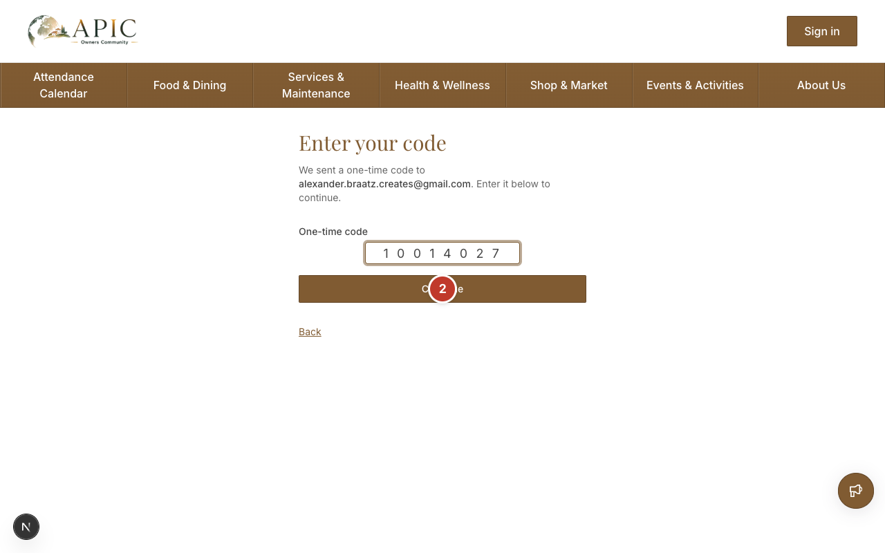

#### Step 2 — Set your password

- Enter a **Password** and **Confirm password** (at least 8 characters).
- Click **Continue**.
- You should see **Privacy & analytics** (Step 2 of 5).

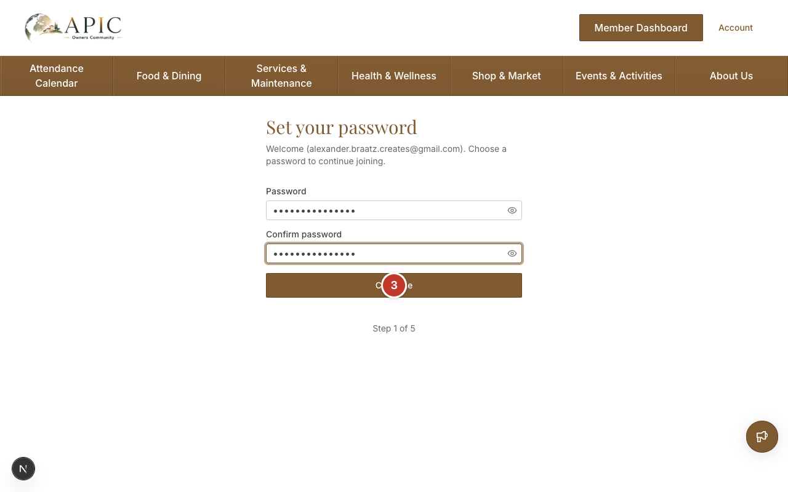

#### Step 3 — Accept privacy choices

- Check **I accept the Terms & Conditions and have read the Privacy Policy.**
- Optionally leave **Usage analytics** and **Product insights** on or turn them off.
- Click **Continue**.
- You should see **Your shown name** (Step 3 of 5).

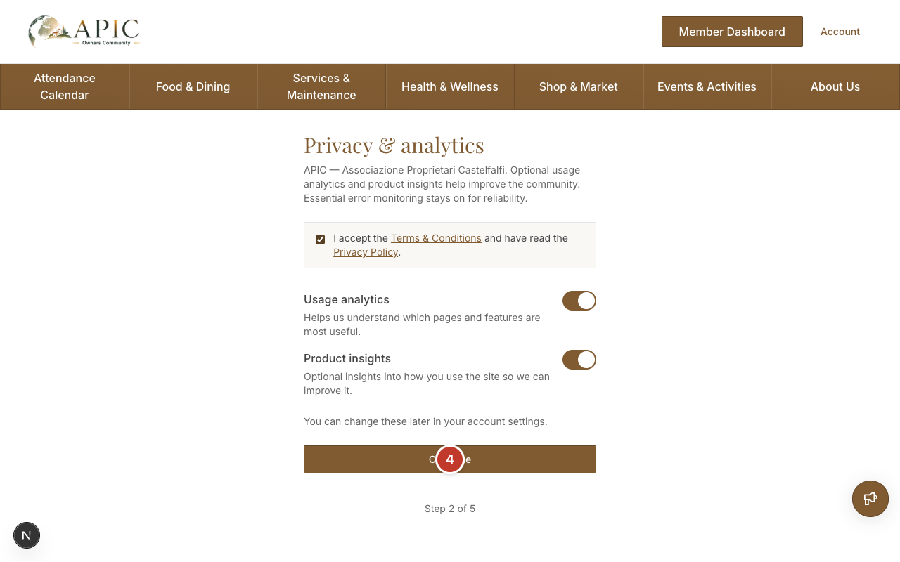

#### Step 4 — Choose your shown name

- Enter the name other members will see in **Shown name**.
- Click **Continue**.
- You should see **Choose your colour** (Step 4 of 5).

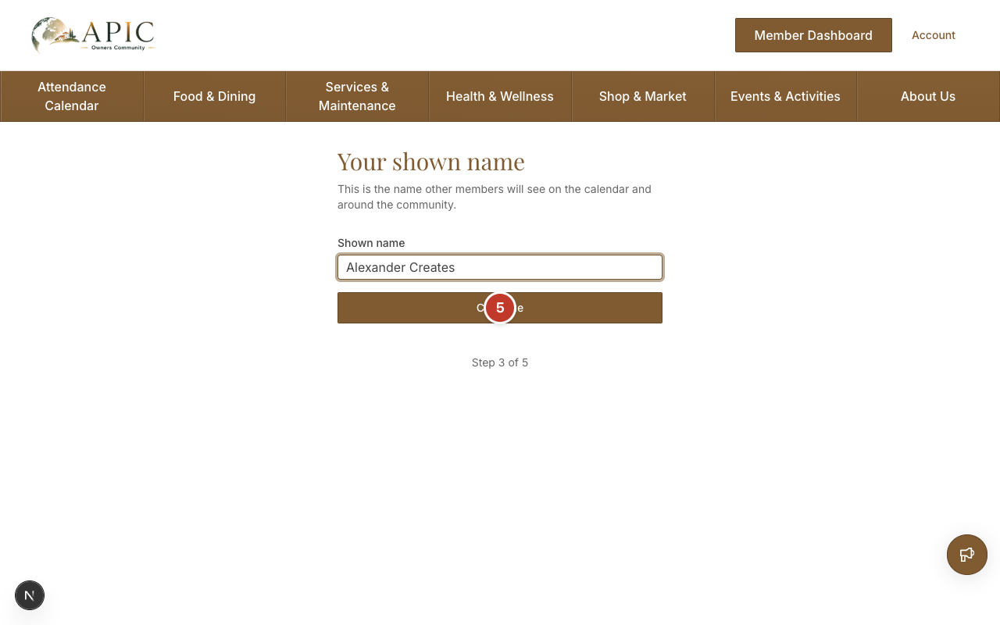

#### Step 5 — Choose your profile colour

- Select a **Profile colour** (used behind your initial on the calendar).
- Click **Continue**.
- You should see **Find your favorites** (Step 5 of 5).

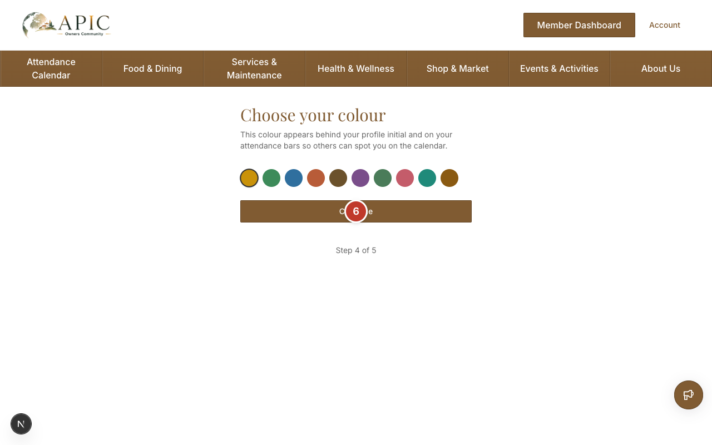

#### Step 6 — Favorites (or skip)

- Optionally search under **Find people** and add favorites, then click **Save favorites and continue**.
- Or click **Skip for now**.
- You should land in the members hub (**Members Area**).

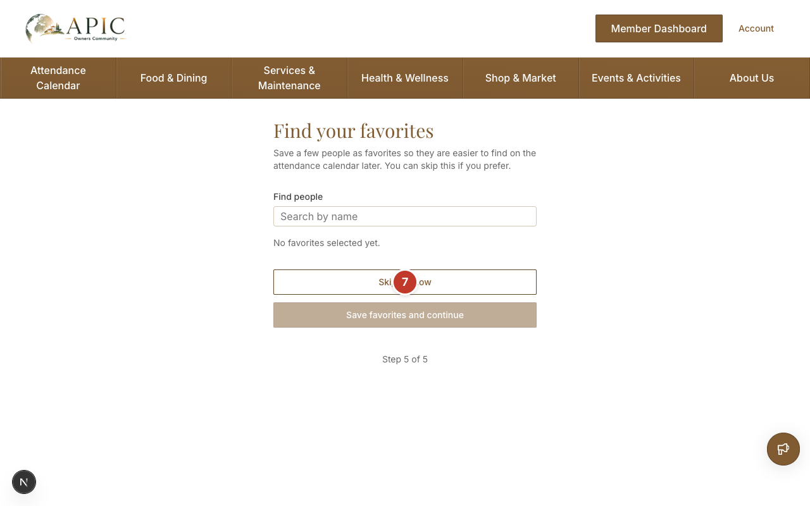

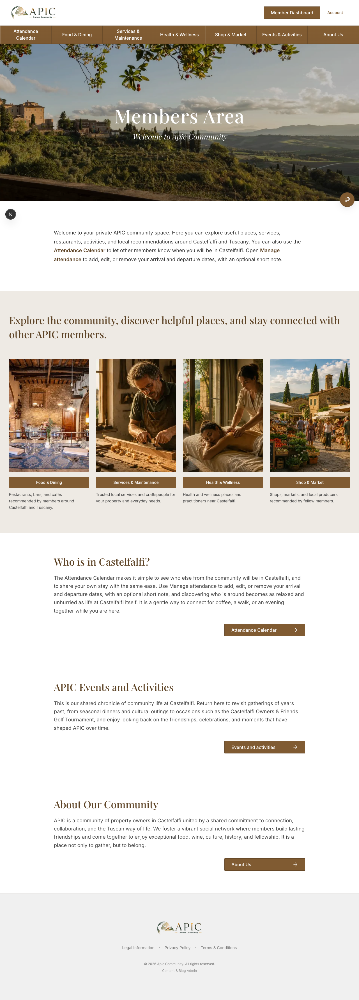

---

## US-04 — Reset a forgotten password

### Overview

If you already have an account, request a one-time code by email, enter it on the reset pages, and choose a new password. Codes expire after 24 hours; if a code expires, return to **Reset password** and click **Request a code** again. Your new password must be different from your current one.

### Steps

#### Step 1 — Request a reset code

- From **Sign in**, click **Forgot password?**, or open `/forgot-password`.
- Enter your **Email**.
- Click **Request a code**.
- You should see **Enter your code**. For privacy, the site confirms a code is sent only if that email is registered.

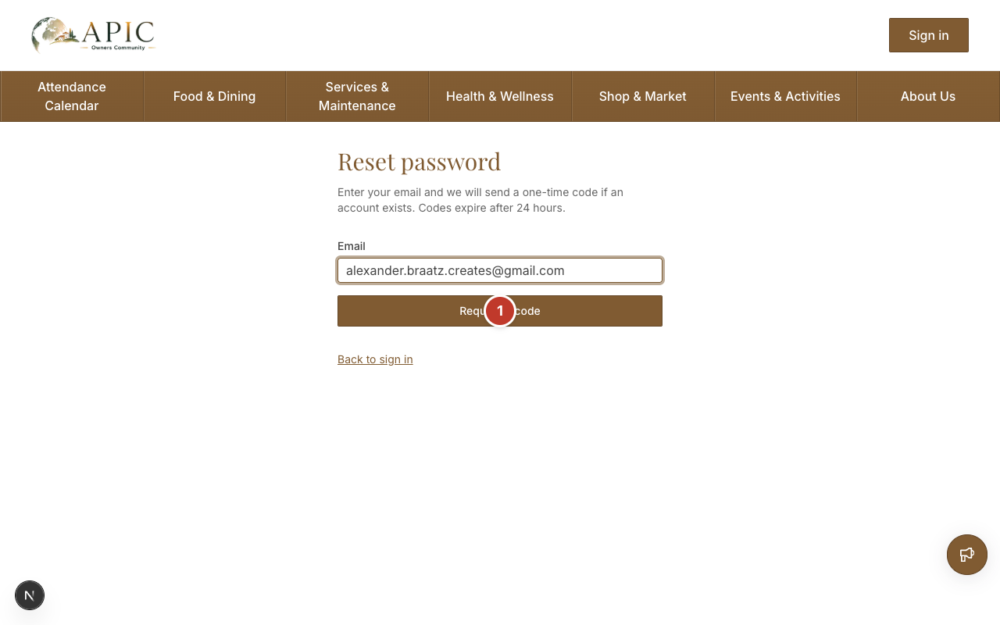

#### Step 2 — Enter the code from your email

- Open the reset email and copy the 8-digit code.
- Enter it in **One-time code**.
- Click **Continue**.
- You should see **Choose a new password**.

If the code is invalid or expired, go **Back**, then **Request a code** again.

#### Step 3 — Choose a new password

- Enter **New password** and **Confirm password**.
- Click **Save password**.
- You should return to the members area (**Members Area** / `/place`).

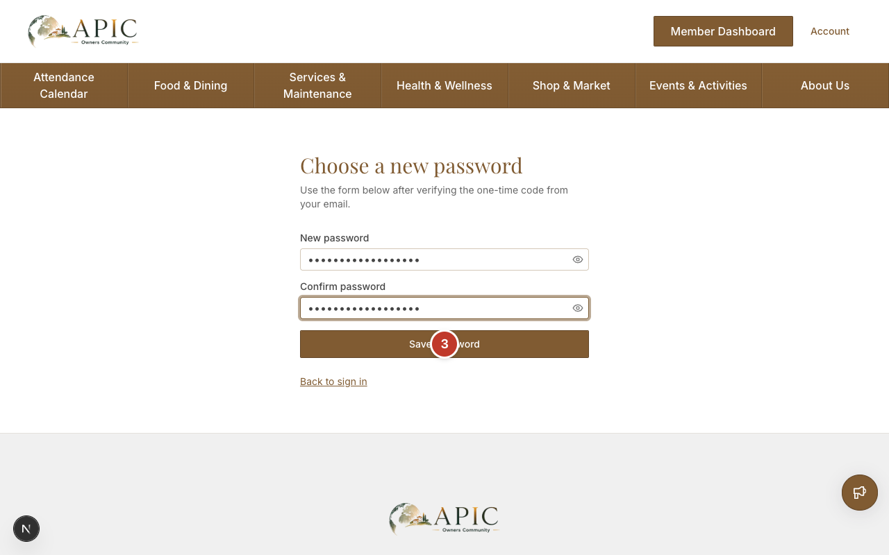

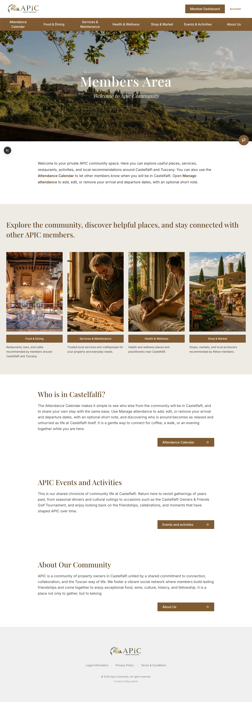
