# Member Manual

How to use the map, calendar, and pinned members.

## Table of Contents

- [Find Recommendations](#find-recommendations)
- [Go back to overview of all recommendations](#go-back-to-overview-of-all-recommendations)
- [How to Add, change or delete your attendance dates](#how-to-add-change-or-delete-your-attendance-dates)
- [How to Pin Members for Easy Attendance Comparison](#how-to-pin-members-for-easy-attendance-comparison)

---

## Main User Map Actions

### Overview

Browse member recommendations on the map, open a place, then return to the full list when you are done.

### Find Recommendations

1. Scroll to browse recommendations.
2. Search for recommendations.
3. Select a recommendation from the map.

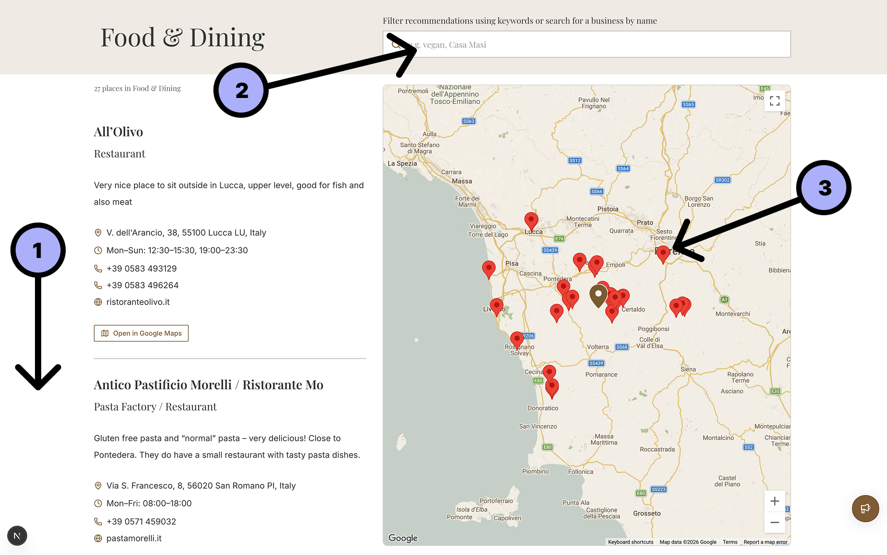

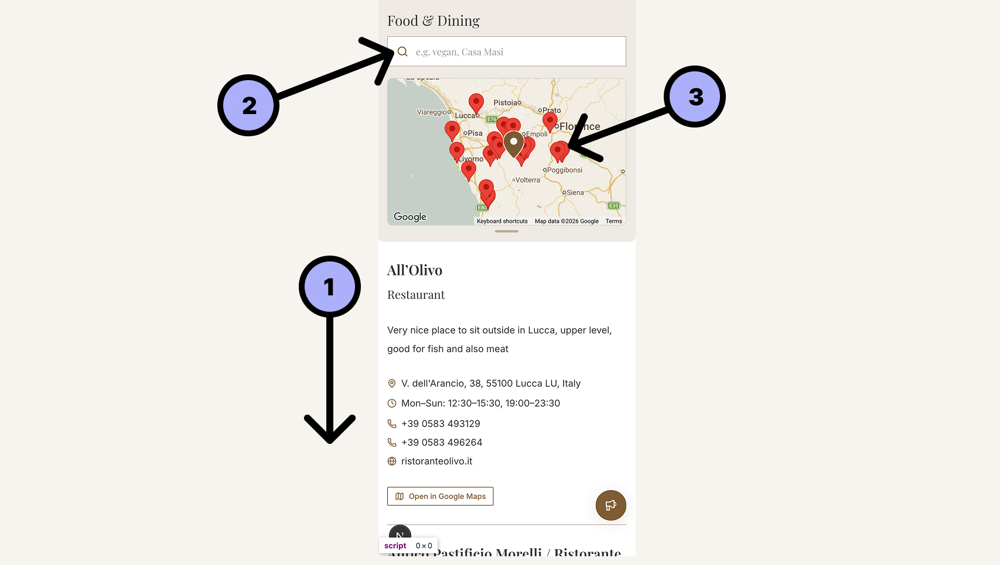

### Go back to overview of all recommendations

1. Open the recommendation in Google Maps.
2. Return to the overview of all recommendations.

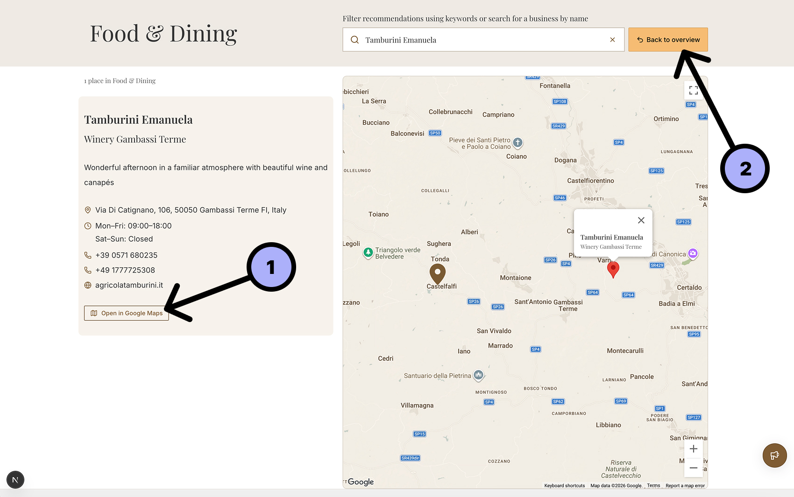

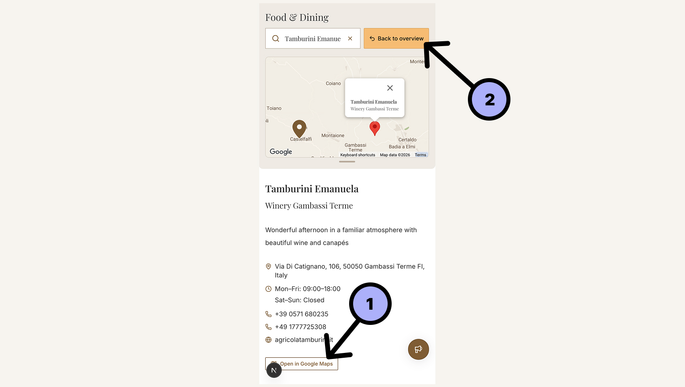

---

## Main User Calendar Actions

### Overview

Manage your own attendance dates on the shared calendar, and pin other members so you can compare who will be around.

### How to Add, change or delete your attendance dates

1. Click the **Manage attendance** button.

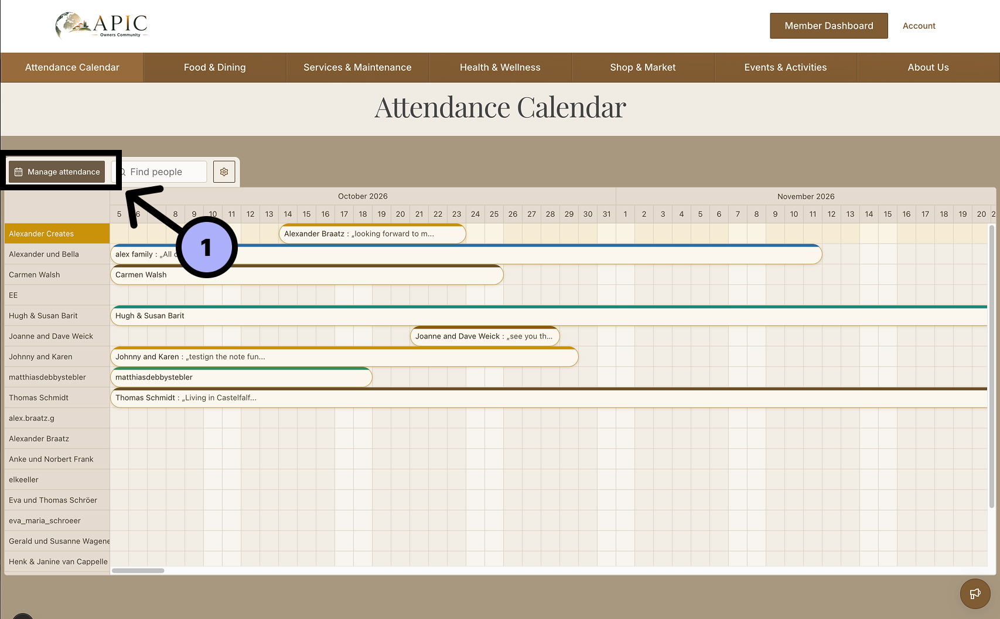

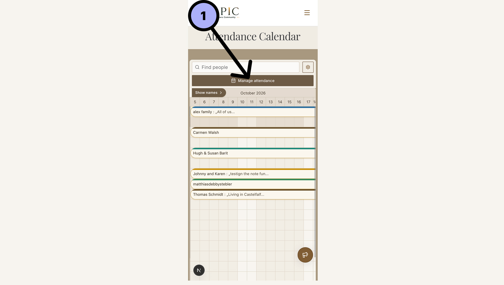

1. Click an existing row to edit that calendar entry.
2. Click a new row to add a new calendar entry.

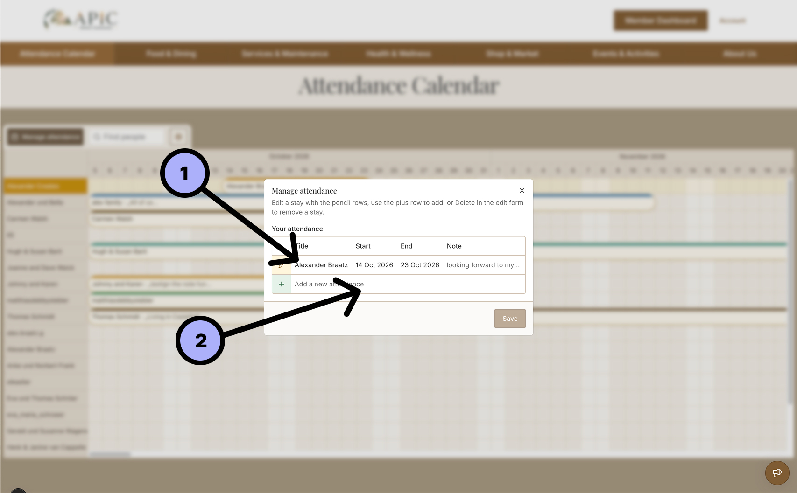

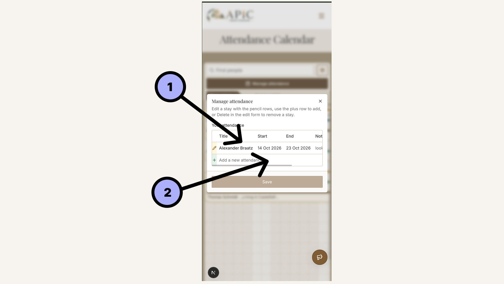

1. Edit the start date, end date, title, and note.
2. Save your changes.
3. Delete this calendar entry.

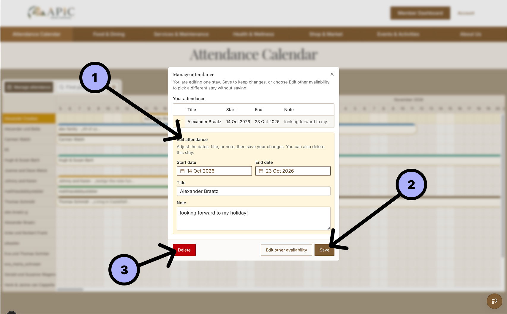

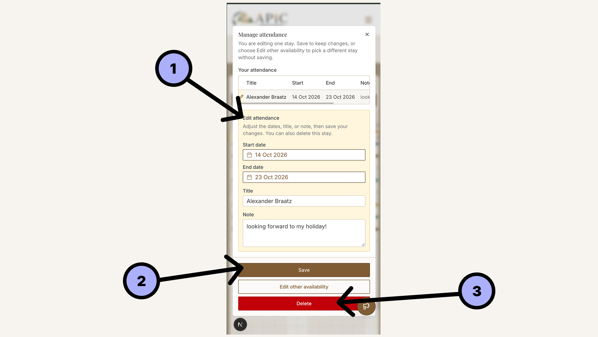

1. Add a start date, end date, title, and note.
2. Save this new calendar entry.

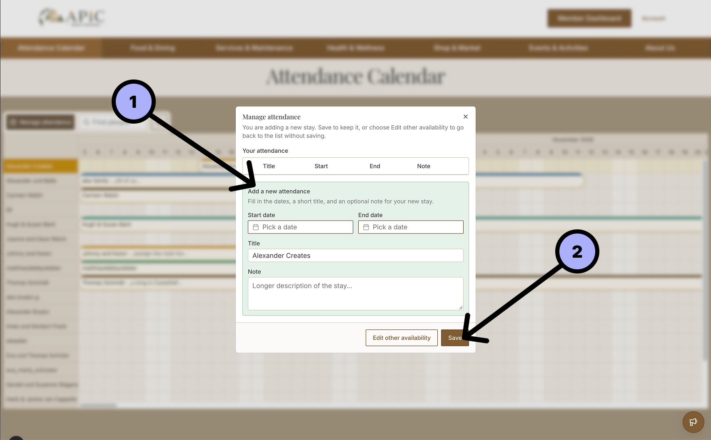

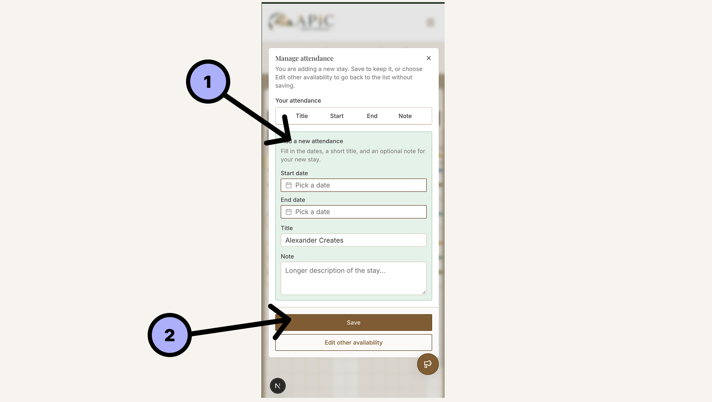

### How to Pin Members for Easy Attendance Comparison

1. Type the name of the member into the search field.
2. Click the **Pin** icon to pin that member to the top of the calendar.

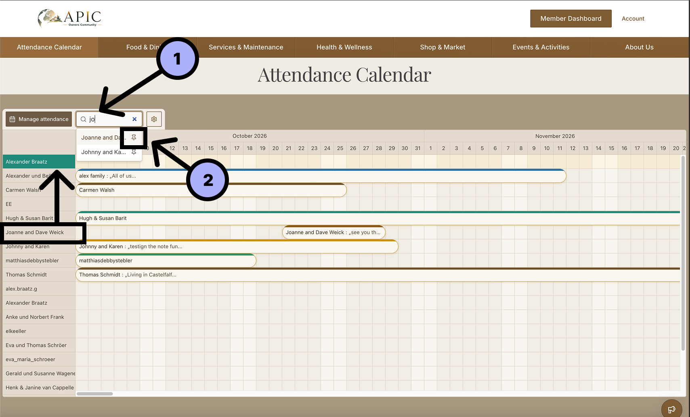

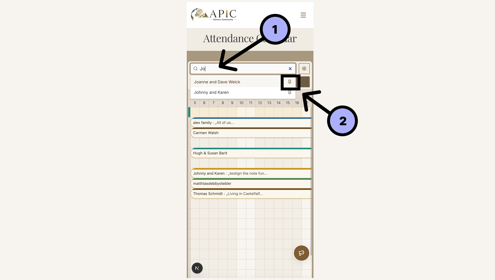

1. Observe that the pinned member is now at the top of the calendar.

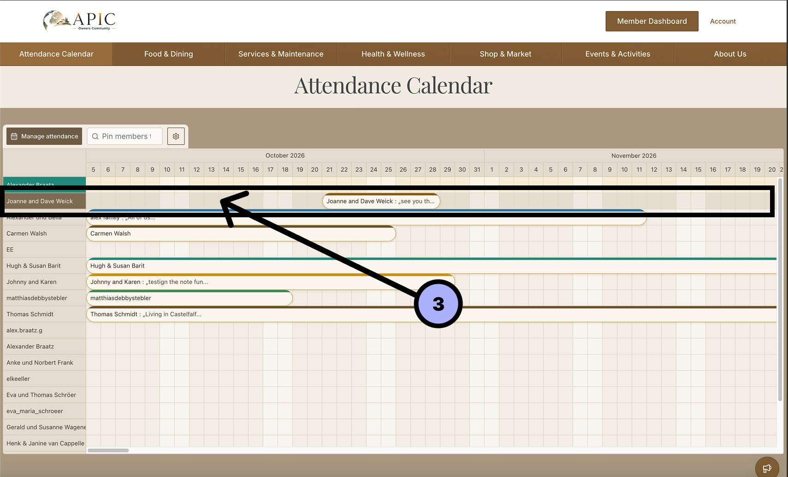

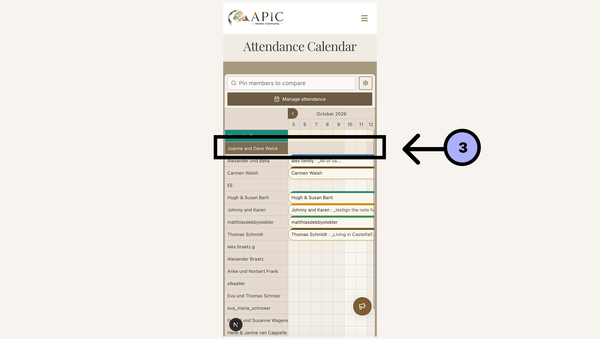
