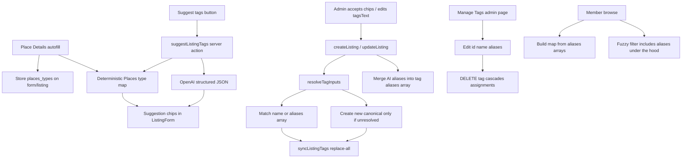
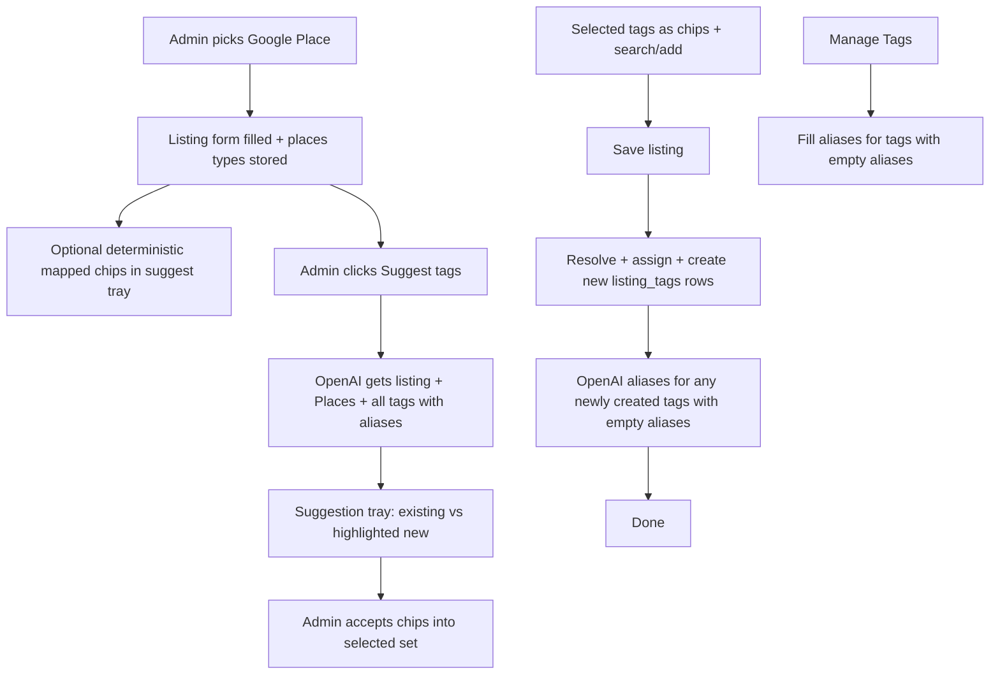

# Listing tag system improvement

**Status:** Plan (not implemented yet)  
**Overview:** Extend listing tags with under-the-hood aliases stored as `text[]` on `listing_tags`, Places→tag mapping, and OpenAI suggest-on-listing-form. Aliases stay hidden on listing forms and member browse. Admins manage tags (and their alias arrays) on Manage Tags next to Audit log. Only canonical tag names are unique—no alias uniqueness enforcement.

## Implementation phases

| Phase | Scope |
|-------|--------|
| A | `listing_tags.aliases text[]` + `places_types` columns + tag-resolution + `syncListingTags` alias resolve + curated seed; delete tag cascades assignments |
| B | Expand Place Details types, persist on listings/form, deterministic places-type-tags map + admin chips (canonical only; no alias UI) |
| C | Suggest tags button + chip flex UI (confirm remove, search, add new); save creates tags; save-time alias generation for new empty tags |
| D | Build alias map from `tags.aliases`; alias-aware listings-search (aliases never shown as chips); wire ListingsBrowse |
| E | Manage Tags page + Fill missing aliases button; table `id`/`name`/`aliases`; rename/edit/confirm delete |
| F | Vitest for resolution/Places/AI validation/search; optional category-tag cleanup + audit fix |

---

## 1. Recommended architecture (summary)

Keep categories, routes, and the current `listing_tags` / `listing_tag_assignments` model. Store aliases as a **`text[]` column on `listing_tags`** (no separate alias table). Persist lightweight **Places type signals** on listings, and introduce an admin-only **Suggest tags** pipeline:



**Policy chosen:** OpenAI; new AI tags created only on admin accept+save. AI may also propose aliases; merge into `listing_tags.aliases` under the hood (hidden on listing form / member browse).

**Uniqueness:** only canonical `listing_tags.name` (`lower(trim(name))`). **No alias uniqueness** across tags or against names—if `italian` and `italien` both exist as tags, or the same alias string appears on two tags, browse/suggest may surface both and that is acceptable.

**Admin taxonomy UI:** Manage Tags page. Listing form shows canonical suggestions only.

---

## 2. Current-state findings (repo-specific)

| Area | Reality |
|------|---------|
| Schema | `listing_tags` + `listing_tag_assignments`; unique on `lower(trim(name))`; no aliases |
| Write | [`parseTags`](../lib/listings/types.ts) → [`syncListingTags`](../lib/listings/admin-actions.ts) delete-all + insert; creates missing names |
| Admin UI | [`components/admin/listing-form.tsx`](../components/admin/listing-form.tsx) comma `tagsText` + first-24 unused `knownTags` chips (not query-filtered) |
| Places | [`lib/listings/places.ts`](../lib/listings/places.ts) `placeDetails` field mask omits `types` / `primaryType`; [`PlaceAutofill`](../lib/listings/types.ts) has no type fields; **no `place_id` stored** |
| Browse | [`fetchListingsForCategory`](../lib/listings/fetch-client.ts) + [`listings-search.ts`](../lib/listings-search.ts) AND chips + fuzzy on name/type/tags |
| AI | **None** in app (`package.json` has no OpenAI / AI SDK) |
| Tests | **None** for tags; no vitest/jest |
| Vocabulary | ~153 tags, ~75 listings; seed also tags category slug/label |

Do **not** conflate DayPilot `event.tags` in attendance.

---

## 3. Schema changes

### Aliases on `listing_tags` (not a separate table)

```sql
alter table public.listing_tags
  add column if not exists aliases text[] not null default '{}';
```

Optional light check (length only, not uniqueness):

```sql
-- reject blank alias elements if easy; otherwise validate in app on write
```

No unique index on alias values. No cross-tag alias collision triggers. Existing unique constraint on `lower(trim(name))` remains the only uniqueness rule.

**Resolution implications:**

| Case | Rule |
|------|------|
| Canonical name match | Always preferred; unique via existing index |
| Alias match on one tag | Resolve to that tag |
| Same alias string on two tags | Allowed; admin write resolve can pick first by name order or attach all matches; member suggest may show both canonicals |
| Alias equals another tag’s canonical name | Allowed; **name match wins** over alias scan |
| Delete tag | Row gone → `aliases` gone; `listing_tag_assignments` already `ON DELETE CASCADE` — no orphans |

### Listings Places type cache

```sql
alter table public.listings
  add column if not exists places_primary_type text,
  add column if not exists places_types text[] not null default '{}';
```

### Migration file

`supabase/migrations/YYYYMMDDHHMMSS_listing_tag_aliases_array_and_places_types.sql`. Regenerate types via `npm run supabase:types`.

**Out of scope:** separate `listing_tag_aliases` table, alias uniqueness, candidate queues, embeddings, `place_id`.

---

## 4. End-to-end create/edit flow (aligned with product picture)



1. Admin starts create (or edit), finds the place via Places API → autofill + store `places_types` / `places_primary_type`.
2. **Suggest tags** is a **button** (not auto OpenAI). Input to the model: listing fields + Places data + **full existing vocabulary (`name` + `aliases`)** so it prefers reuse.
3. Response: mostly existing tags; only propose new when needed. UI marks **new** suggestions differently.
4. Accepting suggestions adds **canonical** chips to the selected set. Aliases from that suggest response are held for save / merged under the hood—not shown on the listing form.
5. **Selected-tags UI** (create and edit):
   - Flex wrap of chips with **X**
   - Removing a chip opens a **confirmation dialog**
   - **Search** to find/add existing tags (match name or alias under the hood; display canonical)
   - **Input** to add a brand-new tag name as a chip (pending create)
6. **Save listing:**
   - Resolve all chips (name → alias → create)
   - Replace assignments; insert any new `listing_tags` rows
   - Merge aliases from the suggest payload for accepted new/reuse tags
   - **Additionally:** for any newly created tags that still have `aliases = '{}'` (e.g. typed manually, no prior suggest aliases), make **one** OpenAI call on save to generate aliases and merge into those rows. If that call fails, listing save still succeeds; aliases can be filled later from Manage Tags.
7. Manage Tags: edit `id`/`name`/`aliases`; delete with confirm + assignment cascade; **Fill missing aliases** button for tags with empty `aliases`.

---

## 5. Alias resolution rules

Shared helper e.g. [`lib/listings/tag-resolution.ts`](../lib/listings/tag-resolution.ts):

```
normalizeLabel(s) = trim + collapse internal whitespace
key = lower(normalizeLabel(s))

resolve(raw, tags: {id, name, aliases}[]):
  1. drop empty / >100 chars (fail validation)
  2. if key matches any tag.name → that canonical
  3. else if key matches any entry in any tag.aliases → that tag (if multiple tags match, take first by name order OR return all—browse may show multiple; write path uses first)
  4. else → unresolved → create new canonical on save
  5. dedupe by canonical id before assign
```

- Display / chips / `listing.tags` always use **canonical names**.
- No global alias uniqueness; within one tag’s `aliases` array, dedupe case-insensitively on write.
- Load once per sync/suggest: all tags with `id, name, aliases`.

---

## 6. Google Places type mapping

**Expand** [`placeDetails`](../lib/listings/places.ts) field mask with `types`, `primaryType`, `primaryTypeDisplayName` (and optionally `editorialSummary.text` for AI context only—do not invent tags from empty data).

Extend `PlaceAutofill` + form hidden fields + listing columns.

New pure module [`lib/listings/places-type-tags.ts`](../lib/listings/places-type-tags.ts):

- Static map `Record<string, string | string[]>` of **useful** Places type → canonical tag name(s).
- Explicit **deny / ignore** list for noise (`point_of_interest`, `establishment`, `geocode`, `political`, etc.).
- Category-awareness: if mapping would only restate the listing category (e.g. `restaurant` → don’t also invent `food-dining` as a tag), skip those.

Example entries: `dentist` → `dentist`; `dental_clinic` → `dentist`; `cafe` → `café` or existing seed casing; `wine_bar` → `wine`; leave unmapped types for AI or ignore.

Pipeline order inside suggest:

1. Deterministic map from `places_types` / `places_primary_type`
2. Resolve mapped strings through name/aliases on `listing_tags`
3. Pass remaining Places types + listing fields to OpenAI as evidence, with instruction not to rediscover mapped types as new tags

Update [`scripts/enrich-listings-places.mjs`](../scripts/enrich-listings-places.mjs) field mask similarly so batch enrichment can backfill `places_*` columns without changing tags automatically.

---

## 7. AI API design (OpenAI)

**Deps:** `openai` SDK; `OPENAI_API_KEY` server-only. Model pinned (e.g. `gpt-4o-mini`).

**Auth:** `requireAdmin()` + rate limit. Never from member browse.

**Calls:**

| Action | When | Purpose |
|--------|------|---------|
| `suggestListingTags` | Admin clicks **Suggest tags** | Reuse/propose tags (+ bundled aliases) from listing+Places+vocab |
| `generateAliasesForTags` | After listing save for new tags with empty aliases; also Manage Tags **Fill missing aliases** | Fill `aliases[]` only |

**Suggest input:** listing fields, Places types, deterministic hints, all tags as `{ name, aliases }[]`, already selected tags.

**Suggest response:**

```ts
type TagSuggestResponse = {
  reuse: string[];
  proposeNew: { name: string; aliases: string[] }[];
  aliasesForExisting: { alias: string; canonical: string }[];
};
```

**Alias-only response:**

```ts
type AliasBackfillResponse = {
  items: { canonical: string; aliases: string[] }[];
};
```

Validate softly (canonical-name collisions only for new tags; no alias uniqueness). Caps + normalize + per-tag alias dedupe.

**Persist on listing save:**

1. `syncListingTags` (resolve + create + assign).
2. Merge suggest-bundled aliases into affected tags.
3. Find newly created tags still with empty `aliases` → `generateAliasesForTags` → merge. Failure is non-fatal.

**Manage Tags backfill:** same `generateAliasesForTags` for all (or selected) tags where `aliases = '{}'`. Admin-triggered; show progress/result count.

**Failure:** Suggest fail → form still editable; save always works without AI.

---

## 8. Admin UX

### 8a. Listing form tags (create + edit)

Replace comma-only input with:

- **Selected chips** — flex wrap; each chip has **X**; **X opens confirmation dialog** before remove
- **Search existing** — typeahead over known tags (match `name` or `aliases`; insert **canonical** chip)
- **Add new** — input + add; adds a pending chip marked as new if not in vocabulary
- **Suggest tags** button — after Place data (or enough fields) exists; tray of suggestions; new proposals highlighted; accept adds to selected chips
- Aliases **never** shown on this form

Same `ListingForm` for create and edit (`mode`).

### 8b. Manage Tags

- Nav **Tags** before Audit log; dashboard link
- One shadcn table: `id`, `name`, `aliases` (no metadata)
- Rename / edit aliases / delete with confirmation (cascade assignments)
- Button: **Fill missing aliases** → OpenAI for tags with empty `aliases` arrays
- Server: [`tag-admin-actions.ts`](../lib/listings/tag-admin-actions.ts) + reuse `generateAliasesForTags`

---

## 9. Member browse / search changes

- Build alias map from `listing_tags.aliases` (single query of all tags)—never render alias strings as chips.
- Query may match via alias; suggestions/`activeTags` show **canonical** names (multiple ok if ambiguous).
- `listingHasAllTags` unchanged.

---

## 10. File-by-file implementation plan

| File | Change |
|------|--------|
| `supabase/migrations/..._listing_tag_aliases_array_and_places_types.sql` | `listing_tags.aliases text[]`; `listings.places_*` |
| `lib/supabase/database.types.ts` | Regenerate |
| `lib/listings/tag-resolution.ts` | Resolve via name then aliases arrays |
| `lib/listings/places-type-tags.ts` / `tag-suggest.ts` / `tag-suggest-actions.ts` | As planned |
| `components/admin/listing-form.tsx` | Chip flex + confirm remove; search/add; Suggest button; no alias UI |
| `components/admin/tags-table.tsx` | Table + Fill missing aliases |
| `lib/listings/tag-admin-actions.ts` | CRUD + backfill missing aliases |
| `lib/listings/tag-suggest.ts` / `tag-suggest-actions.ts` | suggestListingTags + generateAliasesForTags |
| `app/members/admin/tags/page.tsx` + layout/dashboard links | Manage Tags |
| `lib/listings/fetch-client.ts` / `listings-search.ts` / browse | Alias-aware search from arrays |
| `.env.example` / seed / enrich / vitest | As planned |

---

## 11. Migration / backfill

1. Additive: `aliases text[] default '{}'`, places columns.
2. Preserve tag IDs/assignments; seed curated aliases into arrays.
3. No alias uniqueness migration. Soft category-tag cleanup optional via Manage Tags delete.

---

## 12. Tests

| Case | Module |
|------|--------|
| parseTags / normalize / resolve name vs aliases / dedupe assign | `tag-resolution` |
| AI validation; merge aliases; save-time alias backfill for new tags; Fill missing aliases | `tag-suggest` |
| Places map | `places-type-tags` |
| Browse alias query → canonical tag | `listings-search` |
| Ambiguous alias may match multiple tags (allowed) | `tag-resolution` / search |
| AI fail → deterministic-only | `tag-suggest` |
| **No tests** for cross-tag alias uniqueness (explicitly out of scope) | — |

---

## 13. Edge cases and risks

- Aliases only edited on Manage Tags; listing form never shows them.
- Duplicate/overlapping aliases across tags are fine; members may see two suggestions.
- Canonical rename still unique; deleting tag cascades assignments—aliases disappear with the row.
- Soft-merge of AI aliases must not fail the listing save on conflict with itself (just dedupe).
- Member cannot call suggest or tag CRUD.

---

## 14. Implementation order

**Phase A:** `aliases text[]` + places columns; resolution; sync; seed arrays.

**Phase B:** Places types + deterministic chips.

**Phase C:** Suggest button; chip flex + confirm remove; search existing + add new; save creates/assigns tags; save-time `generateAliasesForTags` for new empty tags.

**Phase D:** Browse alias-aware search.

**Phase E:** Manage Tags table (`id`, `name`, `aliases`); rename/edit/delete; **Fill missing aliases** button.

**Phase F:** Vitest + optional hygiene.
